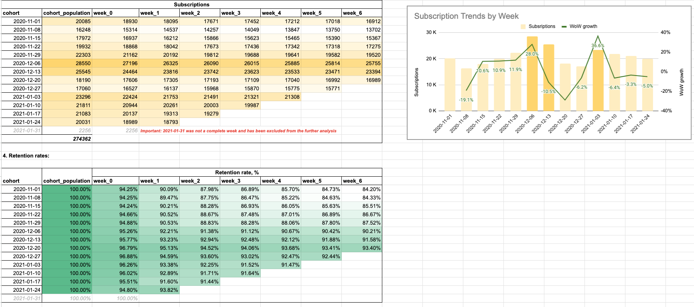

# Retention, Cohorts & Churn
## Task Description
You got a follow up task from your product manager to give stats on how subscriptions churn looks like from a weekly retention standpoint. Your PM argues that to view retention numbers on a monthly basis takes too long and important insights from data might be missed out.

You remember learning previously that cohorts analysis can be really helpful in such cases. You should provide weekly subscriptions data that shows how many subscribers started their subscription in a particular week and how many remain active in the following 6 weeks. Your end result should show weekly retention cohorts for each week of data available in the dataset and their retention from week 0 to week 6. Assume that you are doing this analysis on 2021-02-07.

You should use turing_data_analytics.subscriptions table to answer this question. Please write a SQL that would extract data from the BigQuery, create effective visualizations by using a Google Spreadsheets and briefly comment your findings.

## Results, Insights and Actionable Recommendations
The whole project (including SQL code, results, visualisations and insights) can be found [here](https://docs.google.com/spreadsheets/d/1K25ePb0APzBJssqrQSDyXxwQ6pjX744LQNBmcQXEAls/edit?usp=sharing).

### Main insights:
- Overall, customer retention showed a steady increase in the last two months of 2020, rising from 84.2% to 93.4% (after 6 weeks). However, there was a subsequent decline in the first months of 2021, with retention dropping by ~1-2%.
- Starting from Dec 6, the Retention rate jumped to over 90% in all cohorts.
- It is noticeable that the amount of subscriptions strongly increases 2 weeks before Christmas (+28%) and a week after the New Year (+36.6%). Although, the seasonality does not affect retention rates.

### Actionable recommendations:
- Continuous monitoring for at least 9 months to have full retention rate picture of the whole year.
- Analyze the factors contributing to the retention drop in early 2021.
- Continue with seasonal promotions and targeted campaigns.