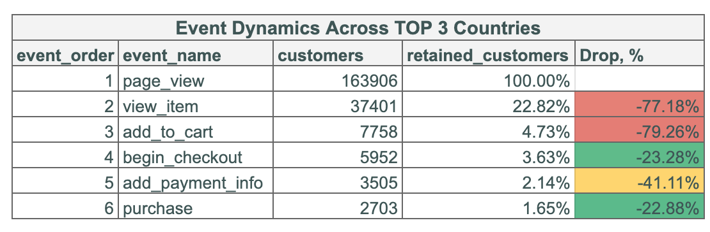

# Funnels
## Task
Your task is to build useful funnel chart from raw_events table data.
1. Analyze the data in raw_events table. Spend time querying the table, getting more familiar with data. Identify events captured by users visiting the website.
2. Now that you have your unique events table create a sales funnel chart from events in it. Not all events are relevant, productive to be used in this chart. Identify & collect data that you think could be used
- Use between 4 to 6 types of events in this analysis.
- Create a funnel chart with a country split. Business is interested in the differences between top 3 countries in the funnel chart.
- Top countries are decided by their overall number of events.
- Provide insights if any found.
- See if you can come up with any other ideas/slices for funnel analysis that could be worth a look.

## Solution
The whole project can be found [here](https://docs.google.com/spreadsheets/d/1-SpX9HGAkjEHU9VVXT0WZo9XUPnRMgrXPDJhwBfcG2I/edit?usp=sharing).

### Insights:						
1)	Approximately 23% of page viewers engaged with a specific item by viewing its page.
2)	A significant proportion, nearly 80%, of users who viewed an item did not proceed to add it to their cart.
3)	Among users who added products to their cart, 23% changed their mind and did not proceed to check out.
4)	Notably, 41% of users who were initially committed to purchasing a product dropped off at the stage of providing payment information.					
5)	Surprisingly, 23% of users who successfully added payment information failed to finalize the purchase. Investigating the factors contributing to this abandonment could provide valuable insights.				
6)	Out of 1000 visitors, only 17 successfully completed a purchase in the final stage.			

Insights:							
1)	The TOP 3 countries contributing to the majority of events in our dataset are the United States, India, and Canada.						
	The US holds a strong lead with 72% of users, outpacing India (15%) and Canada (13%)						
2)	An analysis of the TOP 3 countries' funnels reveals no significant variations in user behavior at each step.						
3)	Canada stands out with the highest conversion rate across all funnel steps.						
	In the US, 1.64% of visitors successfully complete the purchase journey. In India 1.6%, in Canada 1.75% conversion rate.						