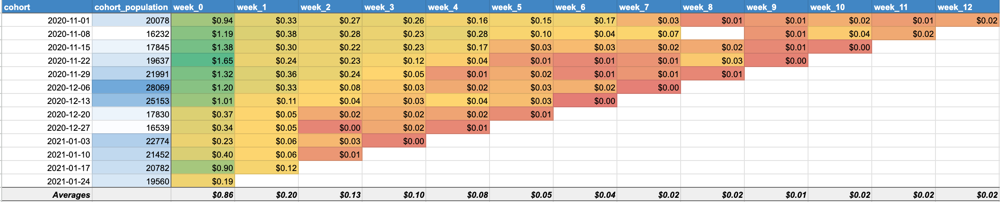
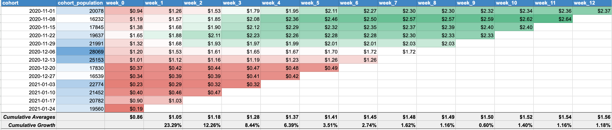
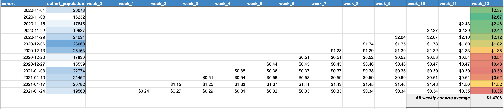

# Customer Lifetime Value Analysis (CLV)
## Task
Customer Lifetime Value (CLV) stands at the forefront of e-commerce analytics, serving as a crucial metric to gauge the long-term value of customer relationships. Recent scrutiny over Shopify's simplistic CLV formula has prompted a shift towards cohort analysis for more reliable insights. This adjustment responds to two key concerns raised by the manager: the need to include all website users, not just purchasers, and the preference for a 12-week cohort analysis to capture customer engagement dynamics more effectively. The ongoing refinement of CLV calculations underscores its indispensable role in shaping marketing strategies and business planning by providing a nuanced understanding of customer value over time.

## Solution
The whole projec can be found [here](https://docs.google.com/spreadsheets/d/1cWjmNPI_tIgtRozHWuSzK4nYkcuOnnk60IgGdNd_zZk/edit?usp=sharing).
### 1. Average order value (AOV) / Number of customers
As the first step you should write 1 or 2 queries to pull data of weekly revenue divided by registrations. Since in this particular site there is no concept of registration, we will simply use the first visit to our website as registration date.

### Insights:	
1)	The average purchase per customer is consistently decreasing on a week-to-week basis.
2)	The average purchase goes down more than 40 times in 12 weeks. This means that as time goes on, each group of customers brings in less revenue.
3)	During the first 7 weeks from 2020-11-01 to 2020-12-20 we observe quite similar results across cohorts.
4)	There is a noticeable decrease in spending during the festive period. From 2020-12-20, the avg purchase per user drops from $1.01 to $0.37. The # of registered users also drops during this period. The numbers start to rise after the New Year. It shows that purchases for this product exhibit seasonality.

### 2. Cumulative sum of revenue growth by number of customers
In the upcoming chart, the revenue/registrations for a specific weekly cohort will be presented as a cumulative sum. To construct this chart, the revenue from the previous week was simply added to the current week’s revenue.

### Insights:	
1)	Cumulative growth also indicates that the most significant increase in revenue (more than 10%) occurs during the first 3 weeks after a customer's registration.

### 3. Future Prediction of posible sales with our current data
Next, the focus is on the future and try to predict the missing data. In this case missing data is the revenue we should expect from later acquired user cohorts. For example, for users whose first session happened on 2021-01-24 week we have only their first week revenue which is 0.19USD per user who started their first session in this week. Though we are not sure what will happen in the next 12 weeks.For this we will simply use previously calculated Cumulative growth % (red marked area in chart aboove) and predict all 12 future weeks values.

### Insights:	
1)	The estimated customer lifetime value, considering a 12-week scenario, is $1.4708. This calculation includes all customers, including those who did not make any purchases. This approach provides a more realistic metric compared to only accounting for customers who made purchases.
2)	The analysis indicates that we can anticipate earning only 35 cents per customer for the last week of the 12-week period. 

### Recommendations:	
1)	Based on the data, it is evident that there is a need to enhance our marketing efforts, particularly in targeting customers during later periods. Implementing promotions could prove effective in boosting potential future spending.
2)	Consider exploring segmentation of customers according to RFM (Recency, Frequency, Monetary), as this would provide insights into identifying high-value customers and areas where improvements are needed in terms of product purchases.