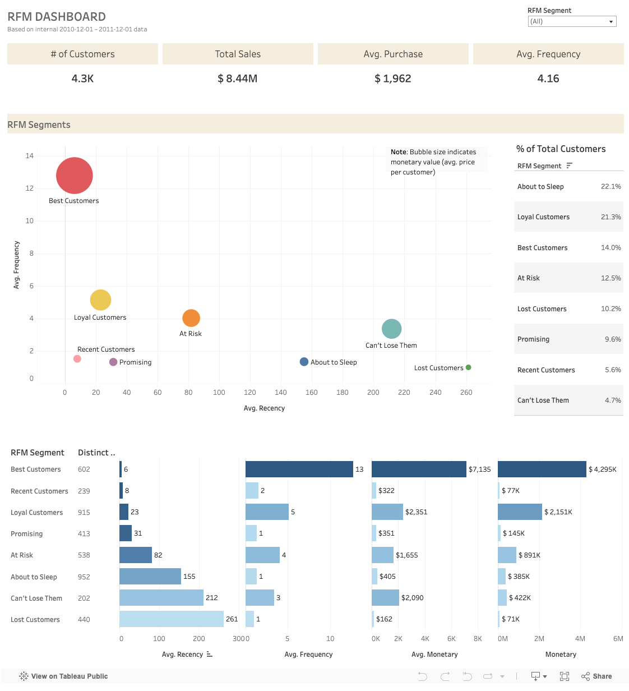
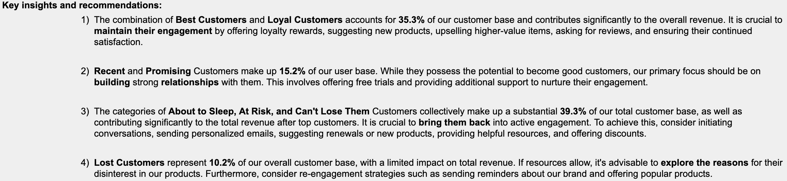

# Customer Segmentation & RFM
## Task
For your graded task, you have to do RFM analysis with a given data set. The data set table is called "rfm" and can be found under "turing_data_analytics" database, placed in the Turing College BigQuery project. Your tasks are:
- Use only one year of data, 2010-12-01 to 2011-12-01.
- Use SQL for calculation and data selection.
- Calculate recency, frequency and money value and convert those values into R, F and M scores by using Quartiles, 1 to 4 values. In BigQuery, a function APPROX_QUANTILES is used to set the quartiles. You can check your results with rfm_value table and rfm_quantiles. Those tables contain intermediate calculations and are used in next steps(1 step: calculate RFM values, possible answer - rfm_value table, 2 step: calculate RFM quantiles from RFM values, possible answer - rfm_quantiles). Important note: the answers in the tables are one of the possible answers. The results might vary due to data filtering options.
- Calculate recency from date 2011-12-01.
- Calculate common RFM score. An example of a possible answer is given in the table rfm_score.
- Segment customers into Best Customers, Loyal Customers, Big Spenders, Lost Customers and other categories.
- Present your analyses with a dashboard.
- Present some insights which customer group/customer groups should the marketing team get focus on.

## Solution
The whole project can be found [here](https://docs.google.com/spreadsheets/d/1pMf55ZnaOePK-fTtfEAn7uhB9dOORQvQQ8vYKFMlE1U/edit?usp=sharing).

Tableau dashboard can be found [here](https://public.tableau.com/app/profile/indre.zabielaite/viz/RFM_17061769472320/RFMDASHBOARD?publish=yes).

